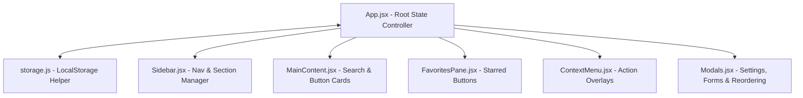

# Chat Agent Copy-Paste Tool

A modern, secure, and sleek single-page web dashboard designed for customer support and call center agents to easily manage and copy-paste repetitive text responses. 

---

## Architecture Overview

The application is built as a Single Page Application (SPA) using **React (scaffolded with Vite)** and styled with custom **Vanilla CSS**. It utilizes a centralized parent-state structure with one-way data flow to children, ensuring reliable updates.



### Component Roles & Interaction:
1. **`App.jsx`**: Controls all primary state variables (`sections`, `favorites`, `searchQuery`, `contextMenu`, `toast`, and `activeModal`). It defines central handlers for addition, removal, updates, clipboard copying, and data import/export.
2. **`storage.js`**: A utility package handling safe read/write sync with `localStorage` (safely loaded/saved inside try-catch blocks to prevent corrupt data crashes).
3. **`Sidebar.jsx`**: Displays a vertical index list of sections. Clicking on a section scrolls the main content panel smoothly to the target card. It also triggers the section creation modal.
4. **`MainContent.jsx`**: Houses the global search bar at the top, which filters buttons and hides empty sections in real time. It displays the sections and their respective copy-paste button cards. Left-clicking a button copies its value; right-clicking opens a custom options menu.
5. **`FavoritesPane.jsx`**: Displays starred copy-paste buttons for quick access. Supports copy-on-click and right-click dismissal.
6. **`ContextMenu.jsx`**: Rendered in the top layer. Dynamically shifts to the mouse pointer (`x`, `y` coordinates) to present contextual options (e.g., Favorite, Edit, Delete).
7. **`Modals.jsx`**: Handles all modal views (Section addition, Button addition, Button editing, settings menu, section reordering list, and JSON import/export checklists).

### Security Enhancements:
- **XSS Mitigation**: React renders variables using safe DOM methods (`textContent`) instead of parsing strings as HTML. The application contains zero instances of `dangerouslySetInnerHTML` or manual `innerHTML` concatenation, resolving legacy code injection vulnerabilities.
- **Escape-Safe Objects**: User inputs are parsed and processed as React state states/objects rather than raw template strings, allowing quotes (`"` and `'`) to be handled natively without breaking JSON structures.
- **Fav Indices Syncing**: Shift-corrected array filters recalculate favorite indices whenever parent items are deleted or reordered, resolving references getting mismatched.

---

## Local Development

### Prerequisites
Make sure you have [Node.js](https://nodejs.org/) (v18+) installed.

### Setup and Running
1. Navigate to the `app` directory:
   ```bash
   cd app
   ```
2. Install the required npm packages:
   ```bash
   npm install
   ```
3. Start the Vite local development server:
   ```bash
   npm run dev
   ```
4. Open the displayed local URL (usually `http://localhost:5173`) in your web browser.

---

## Running Tests

To verify that the application operates correctly and ensure no feature regressions:
1. Navigate to the `app` directory:
   ```bash
   cd app
   ```
2. Run the test suite once (ideal for CI pipelines):
   ```bash
   npm run test
   ```
3. Run the test suite in interactive watch mode for active development:
   ```bash
   npm run test:watch
   ```

---

## Building the App

### Local Production Compilation
To compile the application source code into optimized, minified static HTML, CSS, and JS files:
1. From the `app` directory, run:
   ```bash
   npm run build
   ```
2. The output bundle will be generated inside the `app/dist/` directory.

### Containerization (Docker)
The application uses a **multi-stage Docker build** pipeline outlined in the [Dockerfile](file:///Users/codyuhi/dev/repos/copy-paste-tool/Dockerfile). The process installs Node, builds the static bundle, and serves the files through a lightweight Nginx container.

1. **Build and push the image**:
   Use the `run.sh` script to build the image and push it to your private Harbor registry:
   ```bash
   ./run.sh
   ```
2. **Run the container locally (Alternative test)**:
   To test the production container locally, run:
   ```bash
   docker build -t copy-paste-tool .
   docker run -p 8080:80 copy-paste-tool
   ```
   Access the app in your browser at `http://localhost:8080`.
